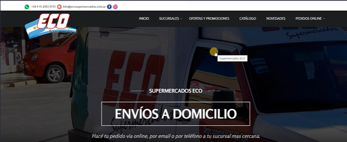
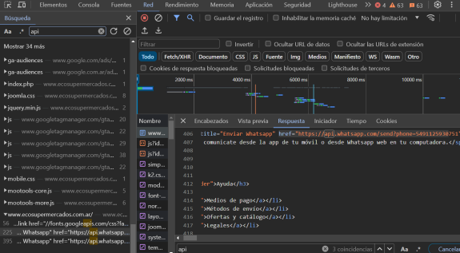
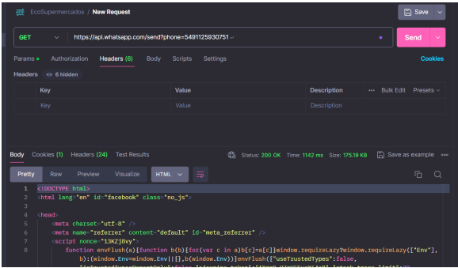

## CONCLUSIONES PROYECTO FINAL TESTING QA MANUAL

### URL Aplicación Web: http://www.ecosupermercados.com.ar (**)

Ecosupermercado es un sitio web perteneciente cadena Eco de supermercados, presenta productos, sucursales con la opcion de pedido online.

En el analisis desarrollado pude observar que no se utilizan apis que ayuden al funcionamiento propiamente dicho del sitio solo se encontraron
apis que hacen a la estructura de la pagina para aportar estilos y habilitar el uso de whatsapp.

Se analizaron los casos de prueba desde lighthouse y desde postman para ver su rendimiento y respuesta, de ellos se desprende que el sitio EcoSupermercados no esta preparado aun para
brindar una buena interaccion con el usuario, si bien brinda la posibilidad de hacer pedidos en linea la seccion destinada para ello debe revisarse y optimizarse a fin de solicitar y obtener
informacion clara y ordenada sobre los productos a comprar por los clientes. 

Se debe prestar atencion a detalles como imagenes cargadas y su visualizacion, mensajes textuales (.... pero se nos hace muy difícil trabajar si se va sumando mercadería a medida que se
va a acordando!) mas neutros.

Si se decide mantener un formulario para pedidos este debe reconocer el tipo de informacion solicitada y alertar cuando no se cumple los requisitos, se recomienda incluir campos que soliciten
detalles como cantidad, producto com un item de lista y envio de confirmacion con validacion de correo electronico

Creo que sin convertirse en un e-commerce se debe optimizar el formulario de pedidos no solo para brindar mejor experiencia al usurio sino tambien para lograr una informacion mas clara que
agilice el trabajo interno.

Se extiende la necesidad de incluir validacion para la seccion de suscribirse que es importante para la fidelizacion del cliente.

La informacion analizada se encuentra en los siguientes documentos:

* INVESTIGACION DE API [(clickear aqui)](PARTE-2/investigacion_de_API_proyecto_final-ecosupermercado.pdf)
* PRUEBAS DE STRESS [(clickear aqui)](PARTE-2/pruebas_de_stress-ecosupermercado.pdf)
* REPORTE DE BUGS [(clickear aqui)](PARTE-2/reporte_de_defectos-ecosupermercado.pdf)
* REPORTE DE PRUEBAS [(clickear aqui)](PARTE-2/reporte_de_pruebas-ecosupermercado.pdf)
* CASOS DE PRUEBAS [(clickear aqui)](PARTE-2/casos_de_prueba-SupermercadoEco.xlsx)

#### **el analisis realizado corresponde unicamente a un caso de estudio para curso de QA MANUAL
